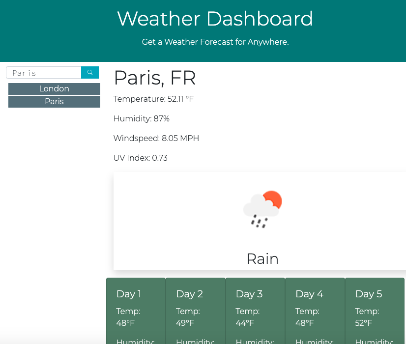

# WEATHER DASHBOARD APPLICATION

#[LINK TO SITE](https://bcefarmer.github.io/weather-dashboard/

#PURPOSE:
The Weather-Dashboard app allows a user to search weather conditions by city, and to have these past searches save to local storage and appear in a list underneath the search bar.

#LANGUAGES USED:
HTML (Bootstrap Framework), CSS, Javascript/jQuery.  

#METHODOLOGIES:
This app's functionality comes from making two separate API calls to the online OpenWeatherMap app and from saving specific searches to local storage as JSON objects in an array. 

When opened, the app initially displays weather information for Kinshasa.  When the user makes a search, an API call is made to the Current Weather API.  This pulls current weather information AND the latitude and longitude of the searched city.  The longitude and latitude are then used to to call the ONE-CALL API, which gives a daily forecast.

The user can also click a past search to re-execute that same search.

DETAILS

Search details saved in local storage.

 

Past lists listed below searchbar.

 
